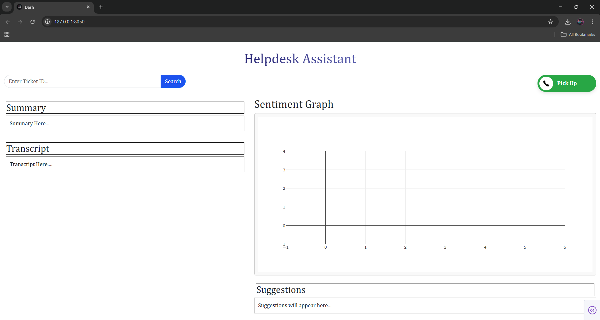

# Helpdesk Assistant: Gemini-Powered Conversational Dashboard

> Real-time insights for sharper conversations, smarter agents.

## 🧠 Description

**Helpdesk Assistant** is a Gemini-powered conversational dashboard designed to help call center agents perform better through real-time analysis of ongoing calls. By integrating cutting-edge AI capabilities like **sentiment analysis**, **summarization**, **transcription**, and **agent suggestions**, this tool empowers agents with instant feedback and actionable insights—directly from the call.

Built with a responsive **Dash** interface, this Python-based tool seamlessly processes live audio, analyzes it with **Generative AI**, and presents results in an intuitive dashboard. Whether it’s customer mood, key points of a conversation, or intelligent response cues, the dashboard ensures that your agents are always one step ahead.

---

## ✨ Key Features

- 🔍 **Real-time Sentiment Analysis**
- 📝 **Live Summarization of Conversations**
- 💡 **Actionable Suggestions for Agents**
- 📜 **Transcription (as an additional layer)**

---

## 🧰 Tech Stack

- **Backend:** Python, Gemini API, `SpeechRecognizer`, `sqlite`, `threading`
- **Frontend:** Dash by Plotly
- **Other Tools:** OpenAI/Google Gen AI for intelligent text processing

---

## ⚙️ Setup Instructions

1. Clone the repository.
2. Ensure you have Python installed (preferably Python 3.8+).
3. Use a Python-based IDE (we recommend **VS Code** for its rich feature set).
4. Navigate to the project folder and run:
   ```bash
   pip install -r requirements.txt
   ```

---

## 🚀 How to Run

1. Make sure you have your **API Key** or **`service-account.json`** file ready.
2. Set the environment variable or point to your key file in your code.
3. Run the app using:
   ```bash
   python firstDash.py
   ```

---

## 🖼️ Screenshots

### 🔹 Landing Page


### 🔹 Dashboard in Action


---

## 📈 Future Improvements

- Build a **multi-page dashboard** with detailed agent-wise and call-wise analytics.
- Add a **manager dashboard** with historical data, agent performance metrics, and summary views.
- Customize landing pages based on **user role** (Agent vs Manager).
- Introduce **call scoring** and performance badges for motivation and gamification.

---
